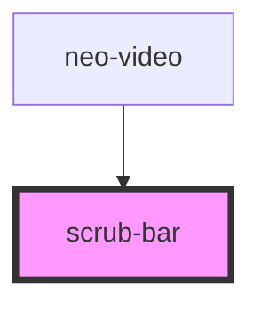

# scrub-bar

<!-- Auto Generated Below -->

## Properties

| Property   | Attribute  | Description | Type     | Default     |
| ---------- | ---------- | ----------- | -------- | ----------- |
| `duration` | `duration` |             | `number` | `undefined` |
| `progress` | `progress` |             | `number` | `undefined` |

## Events

| Event       | Description | Type               |
| ----------- | ----------- | ------------------ |
| `seekEnd`   |             | `CustomEvent<any>` |
| `seekMove`  |             | `CustomEvent<any>` |
| `seekStart` |             | `CustomEvent<any>` |

## Dependencies

### Used by

 - [neo-video](../..)

### Graph

----------------------------------------------

*Built with [StencilJS](https://stenciljs.com/)*
